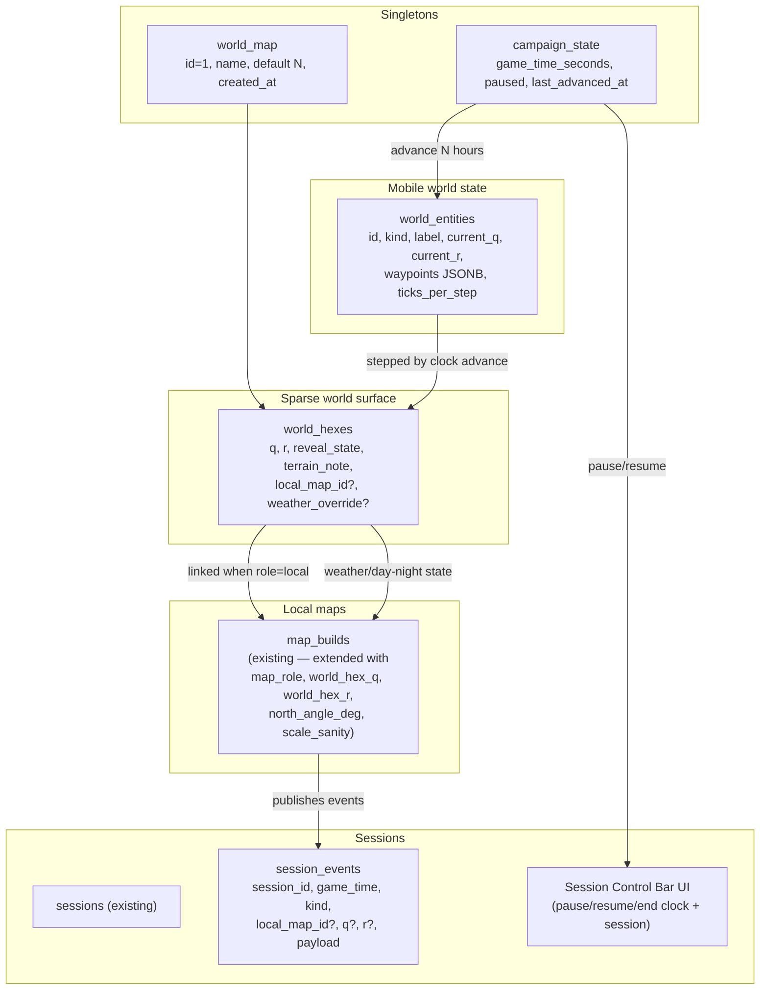

# World map + local map workflow

> **Note for implementing agents:** Work this plan unit-by-unit, in the order given. Each unit lands as one commit. There is no test runner in this repo; verification is `npm run lint`, `npm run build`, and the manual smoke steps in each unit. Do not introduce a test framework as part of this feature.

## Overview

Reframe the Map Builder as a true **map editor** with two first-class concepts: a singleton **world map** that holds the campaign's geography and live state (weather, day/night, moving entities), and **local maps** that anchor to individual world hexes and inherit environmental state from them. A DM-controlled, campaign-wide **game clock** advances world state and is wired into a new **Session Control Bar**. Local maps publish events to a **session event log** so that a future session report can subscribe.

Three of the user's stated v1 priorities drive sequencing:
1. World map fog/reveal + click-into-local-map navigation.
2. Game clock + manual weather, wired to the Session Control Bar.
3. Local map → session event log publishing.

Three things are explicitly **deferred**: AI/auto entity movement, multi-hex local maps, and the camera-based mini detector. Mappy NPC initial-placement detection is **cut entirely**.

## Problem Frame

Today, the Map Builder treats every uploaded map as an isolated artifact. There is no concept of a campaign-wide world, no shared sense of "where are we right now," and no way for environmental state on one map (a storm rolling in on the world map) to affect what the DM is running at the table on the local map. The DM has to mentally bridge those layers session after session.

This plan turns the Map Builder into the spatial backbone of the campaign. The world map becomes the singleton "where" of the campaign. Local maps become anchored views of that world, inheriting its conditions. The game clock becomes the singleton "when," advanced by the DM and reflected everywhere. Session events flow from the table back into a structured log the DM can review after the session.

## Requirements Trace

- **R1.** A world map exists as a singleton. Default state: empty hex grid with N up.
- **R2.** Every uploaded map must be classified as either a **world addition** or a **local map** before editing begins.
- **R3.** A local map is represented as a hex tile and is placed onto a target world hex via a picker. The drop hex becomes the local map's anchor.
- **R4.** Each world hex has one of three states: `unrevealed` (parchment blank), `revealed` (terrain visible, no local map), `mapped` (clickable into a local map).
- **R5.** A campaign-wide **game clock** exists. The DM advances it via explicit "advance N hours / N days" actions.
- **R6.** The game clock is wired to a new **Session Control Bar** that pauses/resumes the clock alongside the session.
- **R7.** The world map maintains live state for moving entities (storms, hordes, caravans, armies, other parties). Each clock advance steps each entity one tick along its waypoint path.
- **R8.** A local map reads current environmental state (weather, day/night) from its parent world hex at game time, rendered as a top-bar pill — never as a pixel overlay on the image.
- **R9.** Local maps publish events to a **session event log** (`session_events` table). Events carry session id, game time, kind, optional local-map / world-hex refs, and a JSONB payload. No report UI in v1.
- **R10.** Mappy detects N direction on uploaded local maps when a marked N symbol is present, with a manual rotation override and an "up = N" fallback. Mappy also flags scale discrepancies between AI inference and user-confirmed grid + scale.
- **R11.** Camera-based mini detection is deferred (TODO note in code).
- **R12.** Multi-hex local maps are deferred. v1 = one hex anchor per local map; sub-locations attach to a parent local map, not a hex.
- **R13.** Auto/AI entity movement is deferred. v1 = manual placement + manual or stored-waypoint advancement.
- **R14.** Mappy initial NPC placement detection is cut entirely.

## Scope Boundaries

**In scope (v1):**
- World map singleton schema, sparse hex storage, fog/reveal, click-into-local-map.
- Upload classification step (world addition vs local map).
- Local map anchoring via world-hex picker.
- Campaign-wide game clock with explicit advance actions.
- Session Control Bar (new component) wired to the clock.
- World entity model (single `world_entities` table with `kind` column) with manual placement and waypoint-step advancement on clock tick.
- Local map environmental inheritance pill (weather + day/night).
- Session event log table + publish helper + a small set of local-map publish points.
- Mappy N detection extension + scale sanity flag.

**Out of scope (deferred — defer with intent, not laziness):**
- Auto/AI entity movement.
- Multi-hex local maps; large towns or megadungeons that span more than one hex.
- Camera feed for player mini detection.
- Session report UI (the event log is the foundation; report UI is a follow-up).
- Player-facing world map view (v1 is DM-only).
- World map image painting / pixel editing.
- Multiple worlds per campaign (singleton enforced).
- Mappy NPC initial-placement detection (cut entirely).
- A test framework. Lint + build + manual smoke is the verification model in this repo.

## Context & Research

### Relevant code and patterns

| Area | Path | Notes |
|---|---|---|
| Schema / DDL | `lib/schema.ts` | `ensureSchema()` is memoized; new tables go here as `CREATE TABLE IF NOT EXISTS`, new columns as `ALTER TABLE … ADD COLUMN IF NOT EXISTS`. Restart dev server after DDL — see CLAUDE.md gotcha. |
| DB pool | `lib/db.ts` | `query<T>(sql, params)` everywhere; no ORM. |
| Hex math | `lib/hex-math.ts` | Flat-top, even-q offset. Already exposes `hexCenter`, `hexPath`, `pixelToHex`, `gridBounds`, `hexNeighbors`, `visibleHexRange`. Reuse for world map rendering. |
| Canonical scale | `lib/map-scale.ts` | `PX_PER_FT = 12`, `cellScreenPx`, `imageDisplaySize`. World map is overland by default → 6 mi/hex → use overland branch. |
| Map builder client | `components/MapBuilderClient.tsx` | Owns the grid confirmation panel state (`gridDraft`). Upload classification step is added here. |
| Map builder home | `app/dm/map-builder/page.tsx` | Server component. Lists builds grouped by session — needs a new "World" surface above the existing groupings. |
| Builder API | `app/api/map-builder/**` | All routes follow the GET/POST/PATCH route handler pattern. |
| Frozen session maps | `maps` table (lib/schema.ts) + `app/dm/maps/DmMapsClient.tsx` + `components/MapCanvas.tsx` | Local maps anchored to a session for play; this plan does **not** rewrite this surface. Local maps in this plan refer to `map_builds`-level entities, which still get `link`'d into `maps` for play. |
| Mappy | `lib/mappy.ts` + `app/api/map-builder/[id]/mappy/route.ts` | Returns `{grid_type, hex_orientation, cell_size_px, scale_guess, confidence, notes}`. This plan extends the schema with `north_angle_deg` and `scale_sanity`. |
| Sessions | `sessions` table (lib/schema.ts) | Has `id, number, title, date, goal, scenes, npcs, locations, loose_ends, notes, sort_order, last_modified, npc_ids, menagerie`. **No game clock column today.** |
| Drag-and-drop | `@dnd-kit/core`, `@dnd-kit/sortable` | Already a dependency — used for the world-hex picker drag-onto-hex affordance. |
| Next.js conventions | App Router, route handlers, `await query()` from server components, client components hydrated separately. No server actions. | See `AGENTS.md`: this is Next 16 with breaking changes — read `node_modules/next/dist/docs/` before guessing API shapes. |

### Institutional learnings (from `MEMORY.md` and past plans)

- `ensureSchema` is memoized — DDL changes require a dev-server restart, and a single DDL failure breaks every page. Keep all DDL idempotent and wrap blocks defensively.
- Tailwind v4 + arbitrary values + Safari production: use inline styles for layout-critical elements (esp. flex containers and the Session Control Bar).
- Don't add scrollable sub-containers without explicit approval; the page itself scrolls.
- No dropdowns without asking — segmented buttons for the upload-classification step.
- Run `tsc --noEmit 2>&1 | grep -v ".next/types"` on a feature branch to filter stale validator noise.
- The Map Builder branch already has 4 stacked commits ahead of main; this work goes on `feat/map-builder` and stays in PR #2's stack.

### External references

None gathered. The patterns this feature needs (hex math, sparse grid storage, clock-tick fan-out, event log) are well-established and there are no recent breaking changes worth chasing externally. If implementation reveals a Next 16 API ambiguity (e.g. server-side fetch caching for the world map page), consult `node_modules/next/dist/docs/` per `AGENTS.md`.

## Key Technical Decisions

1. **World map storage = new dedicated tables.** A singleton `world_map` row plus a sparse `world_hexes` table keyed by `(q, r)` (axial coords for forward compatibility — even though `lib/hex-math.ts` is even-q offset, the DB uses axial because offset coords are display-layer). Cleanly separates world concerns from `map_builds`. Confirmed by user.

2. **Sparse hex storage.** No fixed bounds. `world_hexes` only has rows for hexes that have been touched (revealed, mapped, or carry state). The viewport renders a window centered on activity, with a fallback "show all" when sparse data is small. Naturally supports "world may be incomplete and grow." Confirmed by user.

3. **Campaign-wide singleton clock.** One game clock for the whole campaign, stored on a singleton `campaign_state` row (or extending an existing `campaign` table — see Phase 0 unit 2). Sessions advance the same clock; the world map always has one true "now." Confirmed by user.

4. **Event log only for v1; no report UI.** A `session_events` table with `(session_id, game_time, kind, local_map_id?, world_hex_q?, world_hex_r?, payload JSONB, created_at)` and a publish helper at `lib/session-events.ts`. Local maps publish events from existing actions (asset placed, party entered/exited, NPC interaction). The session report UI is a separate plan. Confirmed by user.

5. **One `world_entities` table with a `kind` column.** Storms, hordes, caravans, armies, and "other parties" share a single table — they're all "things on the world map at a hex with an optional waypoint path." A discriminator column avoids three near-identical tables. Storms get the same advancement model as caravans.

6. **Game time stored as `BIGINT seconds since campaign start`.** Presentation layer translates to in-fiction date/time and human strings. Avoids a fragile in-fiction calendar in the schema and lets the UI swap calendars (Gregorian, Forgotten Realms, custom) without DDL.

7. **World map is DM-only in v1.** No player-facing world map view. If a player view is wanted later, a new surface is added without rewiring the world store.

8. **Local map placement UX = world-hex picker, not draggable hex tile tray (v1).** From the local map editor, a "Set world location →" button opens a world-map picker overlay. The DM clicks the target hex and confirms. A draggable hex tile tray on the world map page is a polish item, deferred until the picker exists end-to-end. The user's spec language ("represented by a hex tile, drag onto world map") is honored visually — the picker shows the local map as a hex tile preview cursor — without committing to the more expensive draggable-tray pattern up front.

9. **Weather is a `world_entities` row.** A storm is just an entity with `kind='storm'` and a waypoint path. When a hex contains an entity of `kind='storm'` at the current game time, that hex's effective weather is `'storm'`. Local maps anchored to that hex render the weather pill accordingly. No separate weather table.

10. **Mappy N detection extends the existing route, not a new one.** `lib/mappy.ts` already has a Claude vision call. We add a `north_angle_deg` field to its return type and prompt the model to detect a marked N symbol when present. The route stores the detected angle in `map_builds.north_angle_deg` and the editor exposes a manual rotation override.

## Open Questions

### Resolved during planning (via AskUserQuestion)

- **World map storage model** → New dedicated `world_map` + `world_hexes` tables.
- **World map extent** → Sparse / dynamic (only touched hexes get rows).
- **Game clock scope** → Campaign-wide singleton.
- **Session report v1 scope** → Event log only; no report UI.

### Assumed (call out so the user can override before implementation starts)

- Single `world_entities` table with a `kind` column covers storms, hordes, caravans, armies, other parties.
- World map is DM-only in v1.
- Game time is `BIGINT seconds since campaign start`; in-fiction calendar is presentation only.
- Local map placement UX is a hex picker (modal) opened from the local map editor — not a draggable tile tray on the world map page.
- Weather is modeled as a `world_entities` row with `kind='storm'`.

### Deferred to implementation

- Exact column names for grid metadata propagation between `map_builds` and `world_hexes` (decide while writing the SQL).
- Whether the world map page reuses `MapCanvas.tsx` directly or wraps a thinner `WorldMapCanvas` derivative — depends on how much DM-notes vs hex-state divergence exists once both render side by side.
- Exact React 19 + Next 16 client/server boundary for the world map page (server component + hydrated client editor is the default; revisit if streaming makes the hex viewport simpler).
- Whether the Session Control Bar lives in a global app-shell layout or only on `/dm/sessions/[id]` pages — depends on whether the DM needs the bar visible while editing maps.

## High-Level Technical Design

> *This illustrates the intended approach and is directional guidance for review, not implementation specification. The implementing agent should treat it as context, not code to reproduce.*

**Read paths:**
- World map page reads `world_map`, `world_hexes` (windowed by viewport), `world_entities` (positions at current game time), and `campaign_state.game_time_seconds`.
- Local map editor reads its own `map_builds` row plus, when `world_hex_q/r` is set, the `world_hexes` row at that anchor and any `world_entities` currently on that hex — to render the environment pill.

**Write paths:**
- Reveal-state changes write `world_hexes`.
- Local map → world hex assignment writes both `map_builds.world_hex_q/r` and the corresponding `world_hexes.local_map_id`.
- Clock advance writes `campaign_state.game_time_seconds` and (in the same transaction) updates `world_entities.current_q/r` for any entity with a waypoint path.
- Local map actions (asset placed, party entered, etc.) call `publishSessionEvent(...)` which inserts into `session_events`.

## Implementation Units

### Phase 0 — Schema foundations

#### - [ ] Unit 1: World map + world hex + world entity schema

**Goal:** Add the dedicated tables for the world map singleton, sparse hex storage, and mobile entities. No UI yet.

**Requirements:** R1, R3, R4, R7, R12

**Dependencies:** none.

**Files:**
- Modify: `lib/schema.ts` — add three idempotent `CREATE TABLE IF NOT EXISTS` blocks and a singleton seed for `world_map` (id=1).
- Create: `lib/world.ts` — typed read/write helpers (`getWorldMap`, `getHex`, `upsertHex`, `setHexReveal`, `listEntitiesAtHex`, `listEntitiesNear`, etc.). No HTTP code in this file.

**Schema sketch (directional, not literal):**
- `world_map`: `id INT PK CHECK (id = 1), name TEXT, default_north_deg REAL DEFAULT 0, created_at TIMESTAMPTZ DEFAULT now()`
- `world_hexes`: `(q INT, r INT) PK, reveal_state TEXT NOT NULL DEFAULT 'unrevealed' CHECK reveal_state IN ('unrevealed','revealed','mapped'), terrain_note TEXT, local_map_id INT REFERENCES map_builds(id) ON DELETE SET NULL, weather_override TEXT, updated_at TIMESTAMPTZ DEFAULT now()`
- `world_entities`: `id SERIAL PK, kind TEXT NOT NULL CHECK kind IN ('storm','horde','caravan','army','other_party'), label TEXT, current_q INT, current_r INT, waypoints JSONB DEFAULT '[]'::jsonb, seconds_per_step BIGINT DEFAULT 21600, created_at TIMESTAMPTZ DEFAULT now(), updated_at TIMESTAMPTZ DEFAULT now()`

**Approach:**
- Append the DDL to `lib/schema.ts` after the existing map_builds blocks.
- Wrap the seed insert for `world_map` in `INSERT … ON CONFLICT DO NOTHING` so reruns are safe.
- Add an index on `world_hexes(local_map_id)` to make the local-map → hex reverse lookup cheap.
- `lib/world.ts` is the only module that writes to these tables — API routes call into it.

**Patterns to follow:**
- Mirror the existing `map_builds` DDL block in `lib/schema.ts` for indentation, comments, and `IF NOT EXISTS` guards.
- Mirror `lib/hex-math.ts`'s flat-top conventions for any helper that converts between axial DB coords and offset display coords; document the conversion in `lib/world.ts`.

**Verification:**
- `npm run lint` clean.
- `npm run build` clean.
- After dev-server restart (per CLAUDE.md gotcha), connect with `psql $DATABASE_URL` and confirm `\dt world_*` lists three tables and `SELECT * FROM world_map` returns one row.
- `tsc --noEmit 2>&1 | grep -v ".next/types"` is clean.

---

#### - [ ] Unit 2: Game clock + session events schema

**Goal:** Add the campaign-wide game clock store and the session event log table. No clock UI yet — that lands in Unit 7.

**Requirements:** R5, R9

**Dependencies:** Unit 1 (no hard dep, but sequencing keeps schema work in one phase).

**Files:**
- Modify: `lib/schema.ts` — add `campaign_state` singleton table and `session_events` table.
- Create: `lib/session-events.ts` — `publishSessionEvent({sessionId, kind, localMapId?, q?, r?, payload})` returns inserted row. Reads current `game_time_seconds` from `campaign_state`.
- Create: `lib/game-clock.ts` — pure helpers: `getGameTime()`, `formatGameTime(seconds)` (presentation), `advanceGameTime(seconds)` (writes `campaign_state` and is the *only* place that mutates the clock; invokes the entity tick from Unit 8).

**Schema sketch:**
- `campaign_state`: `id INT PK CHECK (id = 1), game_time_seconds BIGINT NOT NULL DEFAULT 0, clock_paused BOOLEAN NOT NULL DEFAULT true, last_advanced_at TIMESTAMPTZ DEFAULT now()`
- `session_events`: `id BIGSERIAL PK, session_id INT NOT NULL REFERENCES sessions(id) ON DELETE CASCADE, game_time_seconds BIGINT NOT NULL, kind TEXT NOT NULL, local_map_id INT REFERENCES map_builds(id) ON DELETE SET NULL, world_hex_q INT, world_hex_r INT, payload JSONB NOT NULL DEFAULT '{}'::jsonb, created_at TIMESTAMPTZ NOT NULL DEFAULT now()`. Index on `(session_id, game_time_seconds)`.

**Approach:**
- Seed `campaign_state` with `(1, 0, true)` via `ON CONFLICT DO NOTHING`.
- Keep `lib/game-clock.ts` framework-agnostic; it imports from `lib/db.ts` only.
- `advanceGameTime` is a no-op stub in this unit (just writes the new clock value); the entity-tick fan-out is layered in by Unit 8 to keep the units atomic and reviewable.

**Patterns to follow:**
- Same DDL block style as Unit 1.
- Same "one module owns writes" pattern as `lib/world.ts`.

**Verification:**
- Lint + build clean.
- `psql` confirms the two tables and the singleton row.
- `tsc --noEmit` clean (with the validator filter).

---

### Phase 1 — World map fog/reveal + click-into-local-map (priority 1)

#### - [ ] Unit 3: World map page + sparse hex renderer

**Goal:** Ship a `/dm/world` page that renders the sparse world hex grid, shows reveal state visually, and lets the DM toggle a hex's reveal state. No local map linking yet.

**Requirements:** R1, R4

**Dependencies:** Unit 1.

**Files:**
- Create: `app/dm/world/page.tsx` — server component. Loads `world_map` + all `world_hexes` + the current `game_time_seconds`. Renders a `<WorldMapClient>` with the data.
- Create: `components/WorldMapClient.tsx` — client component. Owns viewport state (pan/zoom), reveal-mode toggle, and the click-to-reveal interaction. Renders an HTML `<canvas>` similarly to `MapCanvas.tsx` but specialized for sparse data.
- Create: `app/api/world/hexes/route.ts` — `GET` (list hexes inside a viewport rect) and `POST` (`{q, r, reveal_state, terrain_note?}` upsert). Calls `lib/world.ts`.
- Modify: `app/dm/map-builder/page.tsx` (or the DM nav, wherever `/dm/maps` is linked) — add a "World" entry pointing to `/dm/world`.

**Approach:**
- Use `lib/hex-math.ts` `hexCenter` and `hexPath` for rendering. Fix a `hexSize` constant (start at 36 px screen-side; revisit during polish).
- Sparse rendering: every `unrevealed` hex inside the current viewport rect draws as a parchment-tone hex; every `revealed` hex draws with a slightly warmer tone; every `mapped` hex draws with a small map-icon glyph in its center.
- "Activity" frame: when the world is empty, the viewport centers on `(0,0)`. When non-empty, center on the centroid of all known hexes.
- Reveal mode toggle in the top bar: `Reveal` / `Note` / `Pan` (button group, no dropdown).
- Click on a hex in `Reveal` mode rotates `unrevealed → revealed → unrevealed` (cycle); `mapped` is read-only here and only set by Phase 2.
- Persist reveal changes via `POST /api/world/hexes`.

**Patterns to follow:**
- `app/dm/maps/DmMapsClient.tsx` — same hex viewport conventions, same canvas mounting pattern, same pan/zoom math. Steal liberally; do not re-derive.
- `components/MapCanvas.tsx` — copy the requestAnimationFrame draw loop and the dpi-aware canvas sizing.
- DM nav: forest green DM context (`#4a7a5a`) per DESIGN.md.

**Verification scenarios:**
- Land on `/dm/world` with an empty world → see a 7×7-ish hex window of `unrevealed` tones around (0,0).
- Click a hex in `Reveal` mode → tone changes to `revealed`. Refresh → still revealed.
- Click again → back to `unrevealed`. Refresh → unrevealed.
- Open the DB and confirm a `world_hexes` row exists for any hex you've ever touched, and that re-touching does not create a duplicate.
- Lint + build clean.

---

#### - [ ] Unit 4: Click-into-local-map navigation

**Goal:** When a hex is `mapped`, clicking it (in any mode) navigates to the linked local map's editor. Round-trip: from the local map editor a "Back to world" link returns to the world map centered on the hex.

**Requirements:** R4

**Dependencies:** Unit 3, plus `map_builds.id` already exists.

**Files:**
- Modify: `components/WorldMapClient.tsx` — handle click-on-mapped-hex by navigating to `/dm/map-builder/<local_map_id>` (or whatever the editor route is per the existing builder).
- Modify: the local map editor entry point (most likely `app/dm/map-builder/[id]/page.tsx` or the equivalent in `MapBuilderClient.tsx`) — add a "← World" breadcrumb when the build has `world_hex_q/r` set. Clicking it returns to `/dm/world?focus=<q>,<r>`.
- Modify: `components/WorldMapClient.tsx` — read `?focus=q,r` on mount and center the viewport on that hex.

**Approach:**
- Use Next 16's `useRouter` from `next/navigation` (App Router). No server actions needed.
- `?focus` is a search param, not state. The world map client just reads it in a `useEffect` on mount.

**Patterns to follow:**
- The existing DM nav back-link patterns in `app/dm/sessions/[id]/`.

**Verification scenarios:**
- (After Phase 2 is in place) Open a mapped hex → land on the local map editor → click "← World" → land back on the world map centered on the original hex.
- A `revealed` (not `mapped`) hex is not clickable as a navigation link.
- Pressing the browser back button from the local map editor returns to the world map at the same focus.

---

### Phase 2 — Upload classification + local map placement

#### - [ ] Unit 5: Upload classification step

**Goal:** When the DM uploads a new map (via `+ New Map` or `+ Drop Map`), the first step after upload is a classification choice: **World addition** or **Local map**. Existing builds are unaffected.

**Requirements:** R2

**Dependencies:** Unit 1 (so a `map_role` column exists on `map_builds`).

**Files:**
- Modify: `lib/schema.ts` — `ALTER TABLE map_builds ADD COLUMN IF NOT EXISTS map_role TEXT CHECK (map_role IN ('world_addition','local_map'))`. Backfill existing rows to `'local_map'` (the safe default — they're not the world).
- Modify: `components/MapBuilderClient.tsx` — after a successful upload (and *before* the existing grid confirmation panel opens), show a centered classification overlay with two segmented buttons: `World addition` / `Local map`. No dropdown.
- Modify: `app/api/map-builder/[id]/route.ts` (PATCH) — accept `map_role`.
- Modify: `app/api/map-builder/route.ts` (POST creating a new build) — accept `map_role` on creation.

**Approach:**
- The classification panel is a separate modal that precedes the grid confirmation panel. Same overlay style as the grid confirmation panel for visual consistency (DESIGN.md "Grid Confirmation Panel" section).
- If `World addition` is chosen, the editor opens to the world map context with this build's image staged for application. (The "apply to world map" path itself is light: the world map is the singleton, so a world addition means the user is editing world hexes / adding terrain notes / placing entities — not creating a separate map_build. v1 simplification: a `World addition` build is held as a *reference image* the DM can pin to a region; full world-image painting is out of scope.)
- If `Local map` is chosen, the editor opens normally, and a new "Set world location →" CTA is added in the editor toolbar (handled by Unit 6).

**Patterns to follow:**
- Existing grid confirmation panel modal in `MapBuilderClient.tsx` for layout, segmented buttons, and Z-index.
- DESIGN.md "no dropdowns" rule.

**Verification scenarios:**
- Upload a new map → classification overlay appears before the grid panel.
- Choose `Local map` → grid panel appears as it does today; the new build's `map_role` is `local_map`.
- Choose `World addition` → land in the editor with a clear visual indicator the build is a world addition. `map_role` is `world_addition`.
- Existing builds (created before this unit lands) are unaffected — they were backfilled to `local_map`.
- Lint + build clean.

---

#### - [ ] Unit 6: Local map → world hex picker

**Goal:** Add a "Set world location →" action in the local map editor. Clicking it opens an overlay world-map picker. The DM clicks a target hex; the picker confirms; the local map's `world_hex_q/r` is set and the corresponding `world_hexes` row is upserted with `reveal_state='mapped'` and `local_map_id` set.

**Requirements:** R3, R4

**Dependencies:** Units 3, 5.

**Files:**
- Modify: `lib/schema.ts` — `ALTER TABLE map_builds ADD COLUMN IF NOT EXISTS world_hex_q INT, ADD COLUMN IF NOT EXISTS world_hex_r INT`.
- Create: `components/WorldHexPicker.tsx` — a modal overlay that mounts a smaller, read-mostly version of the world map. Click selects a hex; confirm posts.
- Modify: `components/MapBuilderClient.tsx` — add the "Set world location →" toolbar button, visible only when `map_role === 'local_map'`. Show the current anchor (e.g. `at (3, -2)`) when set, with an "Edit location" affordance.
- Create: `app/api/map-builder/[id]/world-location/route.ts` — `POST {q, r}` writes both `map_builds.world_hex_q/r` and upserts the `world_hexes` row in a single transaction (`reveal_state='mapped'`, `local_map_id=<this build>`).
- Modify: `lib/world.ts` — add `setHexLocalMap(q, r, localMapId)` that performs the transactional upsert.

**Approach:**
- The picker reuses `WorldMapClient` rendering primitives (extract them to a small subcomponent if cleanest, or pass a `mode` prop). Keep the picker read-mostly: pan and click only, no reveal toggle.
- Hex tile preview cursor: while the picker is open, the cursor follows the mouse with a translucent hex tile bearing the local map's name. This is the visual nod to the user's "local map is a hex tile dragged onto the world map" framing — without committing to a draggable tray.
- Confirmation: a small bottom-right confirm bar showing `Place "<name>" at (q, r)` with `Cancel` and `Place here` buttons.
- When a hex is already `mapped` to a different build, the picker warns and requires explicit confirmation to overwrite (sets the previous hex back to `revealed` and clears its `local_map_id`).

**Patterns to follow:**
- `MapBuilderClient.tsx` modal pattern.
- Existing "DM context" forest green confirm bar styling.

**Verification scenarios:**
- Open a local map with no anchor → "Set world location →" is visible.
- Click it → world map picker opens; pan; click an unrevealed hex → confirm → modal closes; toolbar shows `at (q, r)`.
- Refresh the local map → anchor persists.
- Open `/dm/world` → that hex is now `mapped` and clicking it returns to the local map (Unit 4 verification).
- Try moving the local map to a hex already mapped to another build → warning fires; choosing overwrite clears the old hex.
- Lint + build clean.

---

### Phase 3 — Game clock + Session Control Bar + manual weather (priority 2)

#### - [ ] Unit 7: Session Control Bar component

**Goal:** Ship the Session Control Bar UI (DESIGN.md §53–59 placeholder) and wire its pause/resume/end actions to the game clock's `clock_paused` flag. Long Rest UI is out of scope for this unit (defer to a follow-up).

**Requirements:** R6

**Dependencies:** Unit 2.

**Files:**
- Create: `components/SessionControlBar.tsx` — five-circle layout per DESIGN.md, with `pause/resume`, `end`, and a clock readout. Inline styles for layout-critical elements per the Tailwind v4 + Safari note in MEMORY.
- Create: `app/api/sessions/[id]/control/route.ts` — `POST {action: 'pause' | 'resume' | 'end'}`. Pause/resume toggles `campaign_state.clock_paused`; end marks the session ended (sessions schema may need a `status` column — add via `ALTER TABLE … ADD COLUMN IF NOT EXISTS status TEXT NOT NULL DEFAULT 'open'`).
- Modify: `lib/schema.ts` — add the `sessions.status` column.
- Modify: `app/dm/sessions/[id]/page.tsx` (or the equivalent session detail page) — mount the `SessionControlBar` at the top of the page.

**Approach:**
- Pause and resume both go through the API route, not directly to the DB from the client.
- The clock readout polls `campaign_state.game_time_seconds` on a slow interval (5s) — this is fine v1, no SSE needed.
- "End" prompts confirmation before posting; after success, redirects to the session list.

**Patterns to follow:**
- DM context green chrome (`#4a7a5a`) per DESIGN.md.
- Tailwind v4 + Safari inline-style guidance from `feedback_safari_flex.md`.

**Verification scenarios:**
- Open a session detail page → control bar visible at the top.
- Click `Pause` → bar shows paused state; `campaign_state.clock_paused = true`.
- Click `Resume` → unpaused.
- Click `End` → confirmation → session marked ended; redirected to session list.
- Lint + build clean.

---

#### - [ ] Unit 8: Game clock advance + world entity tick

**Goal:** Ship the "advance N hours / N days" UI on the world map page, and wire it to a transactional advance that steps every `world_entity` along its waypoint path. Clock cannot advance while `clock_paused = true`.

**Requirements:** R5, R7

**Dependencies:** Units 2, 3, 7.

**Files:**
- Modify: `lib/game-clock.ts` — flesh out `advanceGameTime(seconds)`:
  - Read `campaign_state` (error if paused).
  - In one transaction: increment `game_time_seconds`, then for each `world_entity` with a non-empty `waypoints` array, advance its `current_q/r` along the path by `floor(seconds / seconds_per_step)` steps (capped at the path length; entities at the end of their path stop).
- Create: `app/api/world/clock/advance/route.ts` — `POST {seconds}` calls `advanceGameTime`.
- Modify: `components/WorldMapClient.tsx` — add an "Advance time" panel with `+1h`, `+8h (long rest)`, `+24h`, and a custom amount input. Renders the new game time after success. Disabled when paused (poll the same campaign_state endpoint as Unit 7).
- Modify: `app/api/world/entities/route.ts` (create in this unit) — `GET` lists entities, `POST` creates one with `{kind, label, q, r, waypoints?}`. Manual placement; no AI movement.
- Modify: `components/WorldMapClient.tsx` — render entities as small icons centered on their current hex. Storms get a cloud glyph; hordes/caravans/armies/parties get distinct glyphs.

**Approach:**
- Advance is the **only** mutation point for the game clock; nothing else writes `game_time_seconds`. This is critical for not turning the clock into a distributed counter.
- Use a single SQL transaction per advance — the entity step and the clock write commit together or roll back together.
- "Long rest" is a `+8h` advance for v1. Real long-rest semantics (HP, spell slots) are a different feature.
- The viewport refetches entities after advance.

**Patterns to follow:**
- `lib/world.ts` and `lib/session-events.ts` ownership pattern — one module owns DB writes.

**Verification scenarios:**
- Place a `caravan` entity on hex (0,0) with waypoints `[(1,0),(2,0),(3,0)]` and `seconds_per_step=21600` (6 hours).
- Pause the session → click `+1h` on the world map → no movement (clock is paused, advance is rejected). UI shows the rejection.
- Resume → click `+24h` → entity moves to (3,0) and stops (path exhausted). Clock advances by 86400.
- Place a `storm` on a hex with waypoints; advance time → storm moves; verify a local map anchored to a hex *currently containing the storm* will read it correctly (renders the pill in Unit 9).
- Lint + build clean.

---

#### - [ ] Unit 9: Local map environmental inheritance pill

**Goal:** When viewing or editing a local map with a world hex anchor, render a small "environment pill" in the top-right showing current weather and day/night, derived from the parent world hex at the current game time. No pixel overlay on the map image.

**Requirements:** R8

**Dependencies:** Units 6, 8.

**Files:**
- Create: `components/EnvironmentPill.tsx` — pure presentational component taking `{weather, dayNight}`.
- Modify: `components/MapBuilderClient.tsx` — when the build has `world_hex_q/r`, fetch environment state on mount and on every game-clock change.
- Create: `app/api/world/hexes/[q]/[r]/environment/route.ts` — `GET` returns `{weather: 'clear'|'storm'|..., dayNight: 'day'|'night', gameTime: <iso-ish string from formatter>}`. Resolves weather from any storm entity currently at this hex; resolves day/night from `game_time_seconds % 86400` (a simple model — sunrise at 6, sunset at 18; calendar concerns are deferred).

**Approach:**
- Day/night is a pure function of `game_time_seconds`; no DB write needed.
- Weather is whatever entity (if any) of `kind='storm'` currently sits on the hex; if none, weather is `'clear'`. Hex's `weather_override` (if set) takes precedence — this is the DM's "the weather here is special, ignore world-state" escape hatch.
- The pill polls the environment endpoint on a 5s interval (matches the control bar). Acceptable for v1.

**Patterns to follow:**
- DESIGN.md typographic chrome — pill uses Geist sans, 0.7rem uppercase, gold tracking-[0.15em] header treatment.

**Verification scenarios:**
- A local map anchored to (5,5) with no storm → pill says `Clear · Day` (or `Night` depending on clock).
- Place a storm entity on (5,5) → refresh the local map → pill says `Storm · ...`.
- Advance the clock by 6h on the world map → the local map pill auto-updates within ~5s.
- A local map with no anchor → no pill rendered (no errors).
- Lint + build clean.

---

### Phase 4 — Local map → session event log (priority 3)

#### - [ ] Unit 10: Session event publishing from the local map editor

**Goal:** Local map actions publish events into `session_events`. v1 covers a small, useful set: asset placed, local map opened in a session, party-here marker dropped. Future surface area can be added incrementally.

**Requirements:** R9

**Dependencies:** Units 2, 6.

**Files:**
- Create: `app/api/sessions/[id]/events/route.ts` — `GET` returns the most recent N events for the session (ordered by `(game_time_seconds DESC, id DESC)`). `POST` calls `publishSessionEvent`.
- Modify: `components/MapBuilderClient.tsx` — when the editor is opened with a `?session_id=<n>` query param (the DM's "I'm running this map right now" marker), publish a `local_map_opened` event on mount and a `local_map_closed` event on unmount.
- Modify: `components/MapBuilderClient.tsx` (asset placement handler) — after a successful asset placement, publish an `asset_placed` event with `{asset_id, q, r}` in the payload, the local_map_id, and the world_hex_q/r if set.
- Modify: `app/dm/sessions/[id]/page.tsx` — add a small "Recent events" inline list that polls `GET /api/sessions/[id]/events` every 5s. (This is the *only* report-ish UI in v1 and it's intentionally tiny — full session report is a separate plan.)

**Approach:**
- `publishSessionEvent` reads `game_time_seconds` from `campaign_state` so the event timestamp is always game time, not wall time.
- The recent-events list is read-only and minimalist — no filtering, no grouping, just a chronological list. It exists primarily so the DM can see events flowing during play.
- All publish points are best-effort: a publish failure does *not* block the underlying user action. Wrap in try/catch with a console.warn; never throw into the asset-placement handler.

**Patterns to follow:**
- `lib/session-events.ts` from Unit 2 (the only writer to `session_events`).
- DESIGN.md typographic conventions for the small inline events list.

**Verification scenarios:**
- Open a local map with `?session_id=3` → DB shows a `local_map_opened` event with the right session_id, game_time, and local_map_id.
- Place an asset → another event row appears.
- Close the editor (navigate away) → `local_map_closed` event appears.
- Open `/dm/sessions/3` → recent events list shows the events in reverse chronological order, newest first.
- Lint + build clean.

---

### Phase 5 — Mappy N detection + scale sanity

#### - [ ] Unit 11: Extend Mappy with N detection and a scale-discrepancy flag

**Goal:** Extend `analyzeMapGrid` to also return a `north_angle_deg` (degrees CW from up) when a marked N symbol is detected, plus a boolean `scale_sanity_ok` that compares the AI's inferred scale against any user-confirmed scale on the build. Surface both in the grid confirmation panel.

**Requirements:** R10, R14 (no NPC detection — explicitly cut)

**Dependencies:** none functionally; ideally lands after Unit 5 so the classification step exists.

**Files:**
- Modify: `lib/mappy.ts` — extend the tool-use schema to include `north_angle_deg: number | null` and update the prompt to "if a marked N symbol is visible, return its angle in degrees clockwise from up; otherwise return null." Keep failures non-blocking; null is the safe default.
- Modify: `lib/schema.ts` — `ALTER TABLE map_builds ADD COLUMN IF NOT EXISTS north_angle_deg REAL`.
- Modify: `app/api/map-builder/[id]/mappy/route.ts` — persist the new field.
- Modify: `components/MapBuilderClient.tsx` — in the grid confirmation panel, show the detected N as a small compass widget. Always pair it with a manual rotation control (number input with +/- stepper). Default to 0 (up) when null. Show a `Scale sanity: ok | mismatch` chip when the AI's `scale_guess` does not match the user-confirmed `scale_mode`.
- Modify: `lib/mappy.ts` — explicitly do **not** add NPC placement detection. Add a top-of-file comment marking that scope cut for future maintainers.

**Approach:**
- N detection is best-effort. The manual rotation control is the primary input; AI is the convenience.
- `scale_sanity_ok` is computed in the route, not the model — it's just `mappyResult.scale_guess === userBuild.scale_mode || userBuild.scale_mode == null`.
- Never block grid confirmation on N detection. If the API is missing or the call fails, the panel still works.

**Patterns to follow:**
- Existing `lib/mappy.ts` graceful-degradation pattern when the Anthropic API key is missing.
- Existing grid confirmation panel layout in `MapBuilderClient.tsx`.

**Verification scenarios:**
- Upload a local map with a clear N symbol → after Mappy runs, the compass widget shows the detected angle. Saving the build persists `north_angle_deg`.
- Upload a local map with no N → compass widget defaults to 0 (up), manual control still works.
- Upload a square-grid map and manually pick `Overland` scale → sanity chip shows `mismatch`.
- Mappy API unavailable → grid confirmation still works with all fields manually populated; no N field, no sanity chip.
- Lint + build clean.

---

## System-Wide Impact

- **Interaction graph:** The game clock becomes a global mutable singleton. Any feature that wants "current game time" reads `lib/game-clock.ts::getGameTime()`. The Session Control Bar is the only UI that pauses the clock; other surfaces must respect `clock_paused`.
- **Error propagation:** Schema/DDL failures break every page (`ensureSchema` is memoized). All new DDL must be `IF NOT EXISTS`-guarded and idempotent. New API routes return JSON `{ok: false, error}` on failure rather than throwing — match the existing builder API shape.
- **State lifecycle risks:**
  - Clock advancement and entity ticks must be transactional. A partial advance leaves the world in an inconsistent state.
  - Assigning a local map to a hex must transactionally clear any prior `local_map_id` on the previous hex; otherwise two hexes can both claim the same local map.
  - `session_events` writes are best-effort and must never block a user-facing action — wrap in try/catch.
- **API surface parity:** The world map API mirrors the existing map-builder API conventions (route handlers, JSON responses, no server actions). Future agent/MCP tooling that wraps the DM should be able to call any of these with one HTTP shape.
- **Integration coverage:** No automated test runner exists. Every unit ends with a small manual smoke checklist as its verification — that is the integration coverage for this feature.
- **Existing surfaces touched:**
  - `components/MapBuilderClient.tsx` (classification step, world hex picker entry point, environment pill, asset event publish, Mappy N widget) — this file is the most heavily modified by this plan and is already large; if a unit's diff makes it unwieldy, splitting it into two files (`MapBuilderUploadFlow.tsx` and the existing editor) is reasonable.
  - `lib/schema.ts` (new tables in Units 1, 2; new columns in Units 5, 6, 7, 11).
  - DM nav (one new entry, "World") in whichever shared layout owns DM navigation.

## Risks & Dependencies

- **Risk: large `MapBuilderClient.tsx` diff.** This file already owns a lot. Five units modify it. Mitigation: if a unit's diff would push the file past ~1000 lines or tangle multiple concerns, extract a focused subcomponent at that point — don't fight the file size, but don't preemptively shatter it either.
- **Risk: `ensureSchema` memoization can mask DDL failures.** Mitigation: add new DDL in small idempotent blocks; restart the dev server after every schema-modifying unit; verify with `\dt` and column inspection in `psql` before moving on. (`feedback_ensureschema_fragility.md`.)
- **Risk: clock advance + entity tick correctness.** A bug here could silently corrupt world state. Mitigation: keep `advanceGameTime` as the *only* writer; one transaction per advance; add detailed comments inside the helper explaining the step math; manually verify with a few hand-built waypoint paths.
- **Risk: hex picker UX is the place where the user's "drag a hex tile onto the world map" mental model is most at risk of being violated.** Mitigation: make the picker's hex-tile cursor genuinely feel like dragging. If it doesn't, fall back to a true `@dnd-kit` draggable tile from a tray — but only if the picker doesn't deliver the feel.
- **Risk: Next 16 + React 19 client/server seams.** Mitigation: read the relevant `node_modules/next/dist/docs/` page before guessing at a server-component data shape, per `AGENTS.md`. If unsure, default to "server component fetches; client component handles interaction."
- **Risk: scope creep into a session report UI.** Mitigation: explicitly out of scope. The only report-ish UI in this plan is the tiny inline "Recent events" list in Unit 10. If a richer report comes up during implementation, write a separate `ce:plan`.
- **Dependency: PR #2 is the active stack.** This plan's commits land on `feat/map-builder` on top of the existing 4-commit stack. Do not branch off main.

## Documentation / Operational Notes

- Update `DESIGN.md` (already done in this conversation) to keep the "Map workflow" section authoritative.
- After each schema-modifying unit lands, document the new columns/tables in a one-line bullet under `## Gotchas` in `CLAUDE.md` *if* there's a non-obvious gotcha. Otherwise leave CLAUDE.md alone.
- No migration runner exists; new DDL is additive and idempotent. Restart the dev server after each DDL change.
- Lint + build before every commit (per `feedback_tsc_before_deploy.md` and `feedback_commit_early.md`).
- Commit early, commit often. Don't let the linter silently revert in-progress edits.
- Don't push to GitHub without explicit user confirmation (per `feedback_push_to_gh.md`).

## Sources & References

- **Origin spec:** `DESIGN.md` → Map Builder → Map workflow (added 2026-04-07).
- **Codebase research summary:** see Context & Research section above.
- **Active branch:** `feat/map-builder` (PR #2).
- **Prior plans in this stack:** `docs/plans/2026-03-29-001-feat-map-builder-plan.md`, `2026-03-29-002-feat-map-builder-phase4-plan.md`, `2026-04-06-001-feat-map-builder-home-redesign-plan.md`, `2026-04-06-002-feat-map-builder-grid-detection-plan.md`.
- **Resolved planning questions:** see Open Questions → Resolved during planning.
